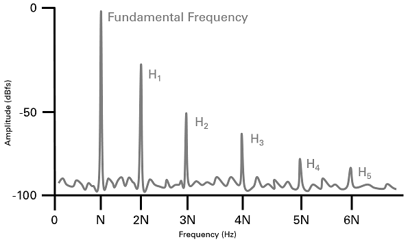
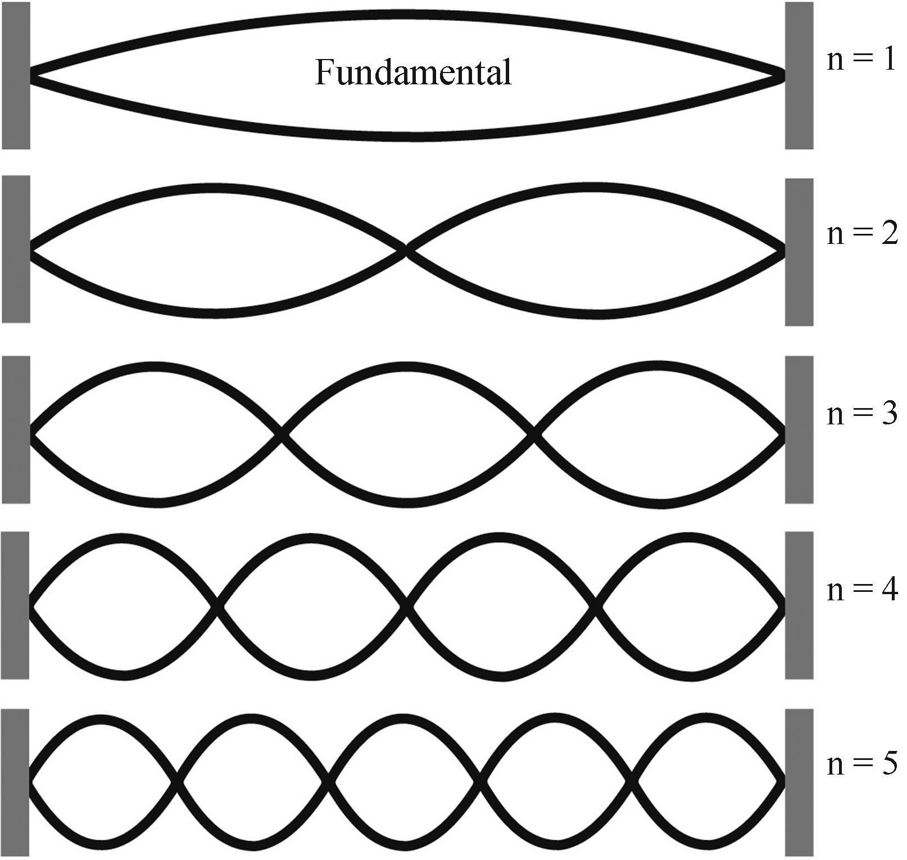
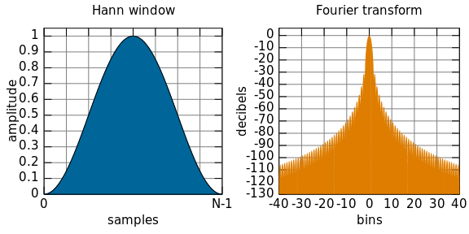

# Signaux sonores

## Son harmonique

----

{width=70%}

----

$$ x(t) = \sum\limits_{k\in\mathbb{N}} A_k\cdot\cos(2\pi k f_0 t) $$

----

## Fourier

$$\hat{x}(f) = \int\limits_{-\infty}^{\infty} x(t)\cdot e^{-2\pi j ft}\mathrm{d}t$$

<video width="800" controls>
    <source src="plot/fourier.mp4" type="video/mp4">
</video>

----

Transformée de Fourier à court-terme (STFT)

$$X(t, f) = \int\limits_{-\infty}^{\infty} x(\tau)\cdot w(\tau-t)\cdot e^{-2\pi j f\tau} \mathrm{d}\tau $$

----

Transformées discrètes:

DFT:

$$ X[k] = \sum\limits_{n=0}^{N-1} x[n]\cdot e^{-2\pi j k \frac{n}{f_s}}$$

STFT:

$$X[n, k] = \sum\limits_{n=0}^{N-1} x[m]\cdot w[m-n]\cdot e^{-2\pi j k \frac{m}{f_s}}$$ 

----

$$w[n] = \sin^2\left(\frac{\pi n}{N -1}\right) $$

# Pitch

Domaine temporelle vs. Domaine fréquentiel

# Onset

# Théorie de musique

# Tempo
