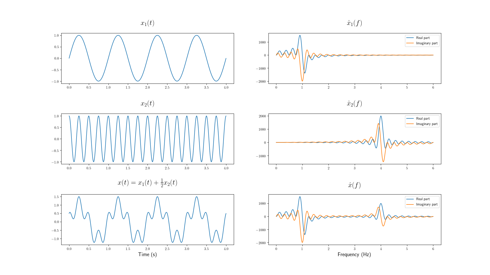
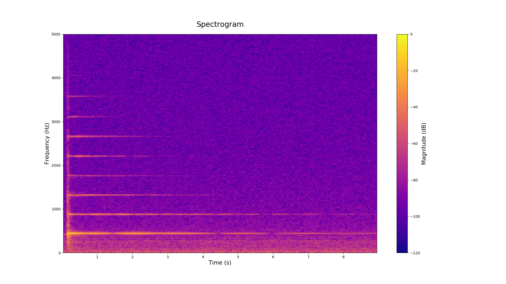
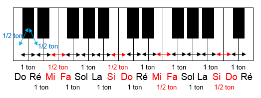

<section id="title-slide">
    
    <h2 class="title">MUALLEF - librarie de transcription de musique</h2>
    <h3 class="title">Projet semestriel - Génie Mathémathique</h3>
    

        Rand ASSWAD 
        Ergi DIBRA 
        Yuge SUN
    

    

        <em>A l'attention de :</em> 
        Mme. Natalie FORTIER
    

</section>

***

*"La vie sans musique est tout simplement une erreur, une fatigue, un exil."*
— **Friedrich Nietzsche**

# Musique & son

## Caractéristiques d'un son

- Hauteur tonale (fréquence)
- Durée
- Intensité (énergie)
- Timbre (source sonore)

## Caractéristiques de la musique

- **La mélodie:** la suite de phrases ou motifs sonores monophones
- **L'harmonie:** l'ensemble de son différents simultanés
- **Le rythme:** la suite de durées du son
- **La nuance:** l'intensité relative du son
- **Le timbre:** la nature du son / son source / son empreinte

***

Le/la musicien(ne) traduisent une partition comprenante les caractéristiques
d'une musique en son, tout en ayant un minimum de liberté.

***

Le projet vise à analyser les caractéristiques d'un son dans l'objectif
d'obtenir ses caractéristiques musicale et de les traduire en une partition.

# Signaux sonores

## Nature d'un signal sonore

>- Signal harmonique $\rightarrow$ **pitch défini**
>- Signal non-harmonique $\rightarrow$ **pitch indéfini**

## Signal Harmonique
{width=50%}

***
$$ x(t) = \sum\limits_{k\in\mathbb{N}} A_k\cdot\cos(2\pi k f_0 t) $$

# La transformée de Fourier

## Signal d'énergie fini
Signal nul $\forall t\not\in [0, t_\text{max}]$

>- Transformée de Fourier (FT)
$$ \hat{x}(f) = \int\limits_{0}^{t_\text{max}} x(t)\cdot e^{-2\pi jft} \mathrm{d}t $$

>- Transformée de Fourier Discrète (DFT)
$$ \hat{x}[k] = \sum\limits_{n=0}^{N-1} x[n] \cdot e^{-2\pi jkn/N} $$

***

Intuition pour la transformée de Fourier d'un signal périodique d'énergie finie

<video width="800" controls>
    <source src="../../figures/out/fourier.mp4" type="video/mp4">
</video>

***

Linéarité de la transformée de Fourier

## Fenêtre d'observation
*Fonction à support compact*

>- Fonction rectangulaire
$$\mathrm{rect}_{[0,T]}(t) = \begin{cases} 1 &\text{si } t\in[0,T]\\0 &\text{sinon} \end{cases}$$
>- Fenêtre Hann
$$w(t) = \begin{cases}
\sin^2\left(\frac{\pi t}{T}\right) &\text{si } t\in[0,T]\\
0 &\text{sinon}
\end{cases}$$
>- Fenêtre Parzen
>- Fenêtre Welch
>- ... 

## Fenêtre de Hann

>- Temps continue: $w(t) = \sin^2\left(\frac{\pi t}{T}\right) 1_{[0,T]}(t)
=\frac{1}{2}\left(1-\cos\left(\frac{2\pi t}{T}\right)\right) 1_{[0,T]}(t)$

>- Temps continue: $w[n] = \sin^2\left(\frac{\pi n}{N-1}\right)
=\frac{1}{2}\left(1-\cos\left(\frac{2\pi n}{N-1}\right)\right), n\in\{0,\dots,N-1\}$

>- Avantage: phénomène *aliasing* attenué

***

## La transformée de Fourier à court terme (STFT)

>- STFT continue d'un signal d'énérgie finie
$$ X(t,f) = \int\limits_{0}^{t_\text{max}} x(\tau)\cdot w(\tau-t)\cdot e^{-2\pi jft} \mathrm{d}\tau $$

>- STFT discrète d'un signal d'énérgie finie
$$ X[n,k] = \sum\limits_{m=0}^{M-1} x[m]\cdot w[m-n] \cdot e^{-2\pi jkm/M} $$

## Spectrogramme

$$ S(t, f) = \left\lvert X(t, f)\right\rvert $$

# Pitch

## Méthodes de détection

>- Domaine temporel
>- Domaine fréquentiel

## Algorithme de YIN

>- Kawahara et de Cheveigné, 2002.
>- Domaine temporel
>- Minimisation de $x[t]-x[t+\tau]$
>- Fonction de différence:
$$ d_t[\tau] = \sum\limits_{i=t+1}^{t+W} \left(x[t]-x[t+\tau]\right)^2 $$
>- Moyenne cumulative normalisée:
$$d_t'[\tau] = \begin{cases}
1 &\text{si} \tau = 0\\
d_t[\tau] / \frac{1}{\tau}\sum\limits_{i=0}^{\tau}d_t[i] &\text{sinon}
\end{cases}$$
>- Séléction progressive de minimum locaux.

## YIN Spectral

>- Paul Brossier, 2006.

# Segmentation temporelle

## Onset - Offset
Les frontières des objets sonores:

>- **Onset:** le début de la note.
>- **Offset:** la fin de la note.

## Détéction des onsets

>- Domaine temporel: énérgie/enveloppe du signal.
>- Domaine fréquentiel: spectre du signal.

## Etapes de détéction des onsets

1. **Onset Detection Function (ODS):** évaluation de niveau de perturbation
2. **Thresholding:** calcul du seuil
3. **Peak-picking:** selection des maximums locaux

## 1. Onset Detection Function (ODS)
Fonctions utilisées:

>- High Frequency Content (HFC)
>- Phase Deviation
>- Complex Distance

## High Frequency Content
$$ HFC[n] = \sum\limits_{k=1}^{N}k\cdot\left\lvert X[n,k]\right\rvert^2 $$

## Phase Deviation ($\Phi$)

>- La phase: $$\varphi(t, f) = \mathrm{arg}(X(t, f)) $$
>- La prédiction: $$\hat{\varphi}(t, f) = \mathrm{princarg}
\left( \frac{\partial^2 \varphi}{\partial t^2}(t, f)  \right) $$
$$\text{avec } \mathrm{princarg}(\theta) = \pi + ((\theta + \pi) mod (-2\pi)) $$
>- La déviation de phase:
$$ \Phi[n] = \sum\limits_{k=0}^{N}\left\lvert \hat{\varphi}[n, k] \right\rvert $$

## Complex Distance

>- La prédiction:
$$ \hat{X}[n, k] = \left\lvert X[n, k] \right\rvert \cdot e^{j\hat{\varphi}[n, k]} $$
>- La distance complexe:
$$ DC[n] = \sum\limits_{k=0}^{N} \left\lvert  \hat{X}[n, k] - X[n, k] \right\rvert ^2 $$ 

## 2. Thresholding

- Seuil fixe:
    + Economie de calculs
    + Compromis en résultats
- Seuil variable:
    + Plus de calculs
    + Meilleurs résultats

***

### Seuil variable
Méthodes de calculs:

- Moyenne mobile
- Moyenne mobile fenêtrée/echelonnée
- Médiane mobile 

## 3. Peak-picking
Séléction des points $t_i$ vérifiants:

1. $\mathrm{ODF}(t_i) \geq$ seuil
2. $\mathrm{ODF}(t_i)$ maximum local
3. *(option)* $\lvert t_i - t_{i-1}\rvert\geq$ délai minimum fixé

# Théorie de musique

***

- image d'un signal
- une ligne de partition

***

La théorie de la musique permet, à la fois de réglementer la musique et
de la libéraliser.

## Notions de bases

- Notes
- Intervalles
- Echelles
- Gammes
- Tempo et rythme

## Note

- La note est le plus petit objet musical.
- Une note porte un nom et caractérise la hauteur tonal du son (fréquence).
- Dans le contexte d'un morceau musical, une note caractérise aussi la durée de cet objet.

## Intervalle

- *Musicalement:* un intervalle désigne l'écart de hauteur tonal entre deux notes.
- *Scientifiquement:* un intervalle est le ratio de fréquences fondamentales
de deux notes.

***

On appelle **_octave_** l'intervalle correspondant au ratio $2:1$
Les notes d'un octave porte le même nom.

## Echelles & Gammes

- Une échelle musicale est une suite d'intervalles conjoints.
- Une gamme musicale est une suite de notes conjointes, la dernière répétant
la première à l'octave.

## Théories différentes de musique
- Ils existent plusieurs théories de musique qui diffèrent principalement
par la composition d'échelles et de gammes.

- Dans ce projet nous avons considéré la théorie de la musique occidentale
basée sur l'accord tempéré.

# Tonalité

## Généralités
- L'unité de tonalité est le **_ton_**.
- En musique classique, le plus petit intervalle est d'un **_demi-ton_**.
- Un octave est composée de 6 tons, soit 12 demi-tons.
- L'échelle majeure classique est composée des intervalles:
1--1--½--1--1--1--½.
- La gamme majeure classique est composée de 7 notes distinctes
(la 8^ème^ est à l'octave de la première).
- **Le dièse (#)** est une altération qui lève une note d'un demi-ton.
- **Le bémol ($\flat$)** est une altération qui baisse une note d'un demi-ton.

## Les notes
Les notes principales sont les touches blanches d'un piano.
Les touches noirs d'un piano sont des notes altérées.

- Noms français: do-ré-mi-fa-sol-la-si
- Noms alphabétiques: C-D-E-F-G-A-B

**Remarque:** Certaines notes altérées sont des touches blanches
(e.g. Mi#=Fa$\equiv$touche blanche), sans détailler sur les altérations
composées (doubles dièses, doubles bémols).

## Les gammes majeures

# Tonalités & Fréquences

# Tempo

# Implémentation

# Merci pour votre attention
