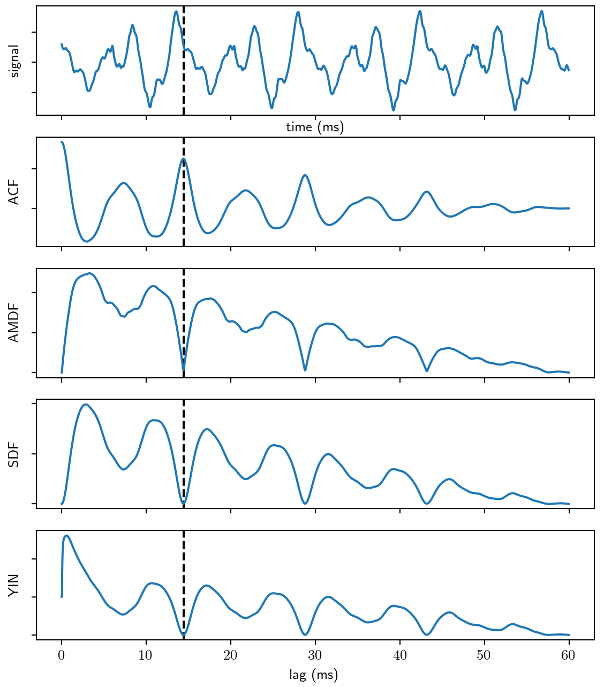
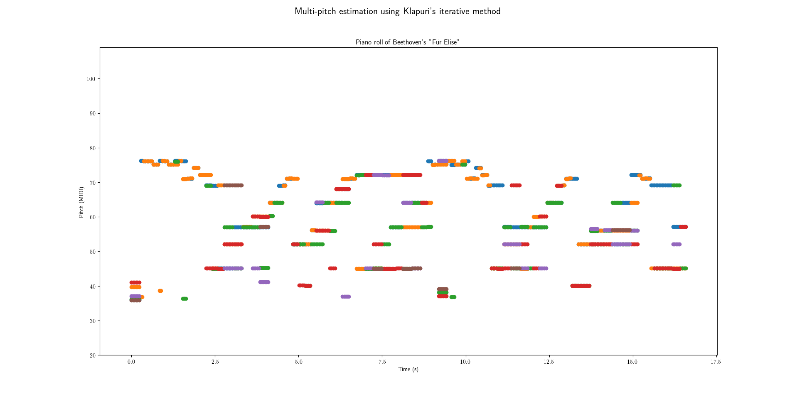
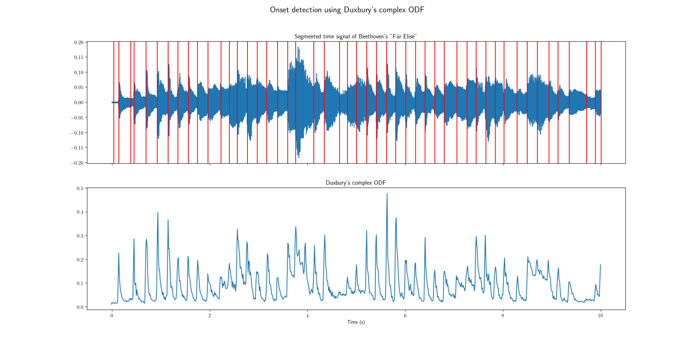

# Summary

- Automatic music transcription
- Audio signal characterization
- Perception of music
- Pitch analysis
- Temporal segmentation
- Conclusion & questions 

\def\R{\mathbb{R}}
\def\C{\mathbb{C}}
\def\N{\mathbb{N}}
\def\Z{\mathbb{Z}}

\def\x{\tilde{x}}
\def\w{\omega}
\def\phi{\varphi}

\def\dt{\mathrm{d}t}

\def\pp#1{\left(#1\right)}
\def\sset#1{\left\{#1\right\}}
\def\vset#1#2{\sset{#1\left\lvert#2\right.}}

\def\abs #1{\left\lvert#1\right\rvert}
\def\norm#1{\left\lVert#1\right\rVert}
\def\dotp#1#2{\left\langle#1{;}#2\right\rangle}

\def\pmat#1{\begin{pmatrix}#1\end{pmatrix}}

\def\qtext#1{\quad\text{#1}\quad}

\def\X{\boldsymbol{X}}
\def\V{\boldsymbol{V}}
\def\W{\boldsymbol{W}}
\def\H{\boldsymbol{H}}

\def\argmin{\mathop{\mathrm{argmin}}}
\def\argmax{\mathop{\mathrm{argmax}}}

# Automatic Music Transcription

> AMT is the process of converting an acoustic musical
signal into some form of musical notation. [@benetos_2013]

## Motivation

- Recording imporvised performance
- Democratizing no-score music genres
- Score following for music learning
- Musicological analysis

## Background

- Started in the late 20^th^ century
- Young discipline (compared to speech processing)
- **ISMIR:** International Society for Music Information Retrieval (since 2000)
- **MIREX:** Music Information Retrieval Evaluation eXchange (15 years)

## Underlying tasks

- *Pitch detection*
- *Temporal segmentation*
- Loudness estimation
- Instrument recognition
- Rhythm detection
- Scale detection

## Music theory vs. audio signal processing

- **Music theory:** studies *perceived features* of music signals.
- **Audio signal processing:** studies the *mathematical variables* of music signals.

# Audio signal characterization

## Physical definition

- Acoustic wave equation [@feynman]
$$\Delta p =\frac{1}{c^2}\frac{\partial^2 p}{ {\partial t}^2}$$

- $p(\mathbf{x},t)$ pressure function of time and space
- $c$ speed of sound propagation
- Harmonic solutions

## Audio signal

- Audio signal : pressure at the receptor's position
- Harmonic function of time
- $$\x(t) = \sum_{h=0}^{\infty} A_h \cos(2\pi hf_0t + \phi_h)$$

## Period and fundamental frequency

> [Period is] the smallest positive member of the infinite set of time shifts
leaving the signal invariant. [@yin_2002]

- $T>0,\forall t, x(t) = x(t+T)$
- $\implies \forall m\in\N,\forall t, x(t) = x(t+mT)$
- **Fundamental frequency:** $f_0 = \frac{1}{T}$
- **Harmonics:** $f_h = h\cdot f_0, h\in\N\setminus\sset{0}$
- **Harmonic partials:** harmonics $h>1$

# Perception of music

## Pitch

- *Tonal height* of a sound
- *Relative musical concept*
- Logarithmic perception
- $\neq$ fundamental frequency

## Intensity

- **Sound intensity:** power carried by sound waves per unit area
- **Sound pressure:** local pressure deviation from ambient
pressure caused by a sound wave
- **Sound pressure level (SPL):**
$$\mathrm{SPL} = 20\log_{10}\left(\frac{P}{P_0}\right)\mathrm{dB}$$
- **_Loudness_**: *subjective* perception of sound pressure
  - Function of SPL and frequency
  - Range from *quiet* to *loud*

---

---

# Pitch Analysis

## General model

[@yeh_thesis]

- Imperfect signals
  - Inharmonicity
  - Resonance
  - Surrounding noise
- $$x(t) = \x(t) + z(t)$$
- $x(t)$ is **quasi-periodic**
- Performed on short-time periods we refer to as **frames**
using a sliding windowing function

## Classification

- **Sound:** Monophonic (single pitch) vs. Polyphonic (multiple pitch)
- **Analysis:** Time domain vs. Spectral domain

## Single pitch estimation

$$\x(t)=\sum_{h=1}^{\infty} A_h\cos(2\pi f_0 t + \phi_h)
    \approx\sum_{h=1}^{H} A_h\cos(2\pi f_0 t + \phi_h)$$

**Task:** find $f_0$

## Time domain

- Analyse signal $x(t)$ directly with respect to time.
- Compare signal $x(t)$ with a delayed version of itself $x(t+\tau)$
- Similarity/dissimilarity functions

## Autocorrelation Function (ACF)

$$r[\tau] = \sum_{t=1}^{N-\tau} x[t]x[t+\tau]$$

- Attains local maximum for $\tau\approx mT$
- Sensitive to structures in signals
  - **(+):** useful for speech detection
  - **(-):** resonance structures in music signals

## Average Magnitude Difference Function (AMDF)

$$d_{\text{AM}}[\tau] = \frac{1}{N}
    \sum_{t=1}^{N-\tau} \abs{x[t]-x[t+\tau]}$$
[@ross_average_1974]

- Attains local minimum for $\tau\approx mT$
- More adapted for music signals

## Squared difference function (SDF)

$$d[\tau] = \sum_{t=1}^{N-\tau}(x[t]-x[t+\tau])^2$$

- Attains local minimum for $\tau\approx mT$
- Accentuates dips at corresponding periods
- More clear local minima

## YIN algorithm  [@yin_2002]

Cumulative mean normalized function:
$$d[\tau] = \sum_{t=1}^{N-\tau}(x[t]-x[t+\tau])^2$$
$$d_{\text{YIN}}[\tau] = \begin{cases}
    1 &\text{if}~\tau = 0\\
    d[\tau] / \frac{1}{\tau}\sum\limits_{t=0}^{\tau} d[t]
        &\text{otherwise}
\end{cases}$$

- Starts at 1 rather than 0
- Divides SDF by its average over shorter lags
- Tends to stay large at short lags
- Drops when SQD falls under its average

---

## Spectral domain

- Analyse fourier transform $X(f)$ of the signal
- The **spectrum** of a signal in the magnitude of its fourier transform $S(f)=\abs{X(f)}$
- Local maxima of the spectrum correspond to frequencies of the signal
- Analyse spectrum patterns with adapted similarity/dissimilarity functions

---

<video width="800" controls>
    <source src="plot/fourier.mp4" type="video/mp4">
</video>

## Autocorrelation Function (ACF)

$$R[f] = \sum_{k=1}^{K-f} S[k]S[k+f]$$

- Attains local maximum for partial harmonics $f\approx hf_0$ [@lahat_spectral_1987]
- Function is attenuated when partial peaks are not well aligned

## Harmonic sum/product [@schroeder_period_1968]

- **Harmonic sum:** $$\Sigma(f)=\sum_{h=1}^H 20\log_{10}S(hf)$$
- **Harmonic product:** $$\Sigma'(f)=20\log_{10}\sum_{h=1}^H S(hf)$$

- Weighted frequency histogram
- Measures the contribution of each harmonic to the histogram
- Also known as *log compression*

---

---

## Spectral YIN [@brossier]

- Optimized version of YIN in frequency domain
- The square difference function is defined over spectral magnitudes
$$\hat{d}(\tau) = \frac{2}{N} \sum\limits_{k=0}^{\frac{N}{2}+1}
    \abs{\pp{-e^{2\pi jk\tau/N}} X[k]}^2$$

### DEMO YIN/YINFFT

## Multiple pitch estimation

\begin{align}
\x(t)&=\sum_{m=1}^{M}\x_m(t)\\
    &=\sum_{m=1}^{M}\sum_{h=1}^{\infty}
    A_{m,h}\cos(2\pi f_{0,m} t + \phi_{m,h})\\
    &\approx\sum_{m=1}^{M}\sum_{h=1}^{H_m}
    A_{m,h}\cos(2\pi f_{0,m} t + \phi_{m,h})
\end{align}

**Task:** find $f_{0,m}$ for $m\in\sset{1,\ldots,M}$

## Challenges

- Concurrent music notes
- Can be produced by several instruments
- *Core difficulty* of polyphonic music transcription

## Approaches

- **Iterative:**
  - Extract most prominent pitch at each iteration
  - Tends to accumulate errors at each iteration
  - Computationally inexpensive
- **Joint:**
  - Evaluate $f0$ combinations
  - More accurate estimations
  - Increased computational cost

## Harmonic Amplitudes Sum [@klapuri]

1. **Spectral whitening:** flatten the spectrum to suppress timbral information.
2. **Salience function:** strength of $f0$ candidate as weighted sum of amplitudes of its harmonic partials.
3. Iterative or joint estimators.

## Spectral whitening

- Apply *bandpass filter* in frequency domain $X(f)$.
- Calculate standard deviations $\sigma_b$ within subbands
- Calculate compression coefficients $\gamma_b=\sigma_b^{\nu-1}$ where $\nu$ is the whitening parameter.
- Interpolate $\gamma$ for all frequencies.
- Whitened spectrum $Y(f) = \gamma(f)X(f)$

## Salience function

$$s(\tau) = \sum_{h=1}^H g(\tau,h)\abs{Y(hf_{\tau})}$$
where $f_{\tau}=f_s/\tau$ the $f_0$ candidate corresponding
to the period $\tau$ and $g(\tau,h)$ is the weight of the
$h$ partial of period $\tau$.

## Iterative estimation

1. Determine $f_0=\argmax_{f} s(f)$
2. Remove found $f_0$ from residual spectrum
3. Repeat until saliences are low

---

---

## Spectrogram Factorisation (NMF) [@NNMF]

- Non-negative matrix factorisation is a well-established technique
- Works best with harmonically fixed spectral profiles (such as piano notes)
- Joint estimation method

## $$\X \approx \W\H$$

- Variables:
  - $\X\in\R_+^{K\times N}$ input spectrogram
  - $\W\in\R_+^{K\times R}$ spectral bases for each pitch component (template matrix)
  - $\H\in\R_+^{R\times N}$ pitch activity across time (activation matrix)
- Dimensions:
  - $K$ number of frequency bins
  - $N$ number of frames
  - $R$ number of pitch components (rank) such that $R<<K$
- Cost function: $$C=\norm{\X - \W\H}_F$$

---

## NMF concept

- $C=\norm{\V-\W\H}_2$ is a nonconvex optimisation problem with respect to $\W$ *and* $\H$.
- Let $\V=(v_1,\ldots,v_N)$ and $\H=(h_1,\ldots,h_N)$
- $\V=\W\H \implies v_i = \W h_i$
- Impose orthogonality constraint $\H\H^T=I$
- Obtain **K-means** clustering property

## Application on polyphonic music decomposition

- The rank $R$ corresponds to the pitch components, which is in the case of a piano is the midi integer range from 20 to 109.
- Reinforce sparsity constraint [@cont_realtime_nodate]
- Apply single pitch estimation on rows of $\H$

# Temporal Segmentation

Finding boundaries of audio objects

- **Onset:** when the note starts
- **Offset:** when the note ends

---

{width=50%}

## Onset estimation method

1. Compute an **Onset Detection Function**
2. Calculate a **threshold function**
3. **Peak-picking** local maxima above threshold

## Onset Detection Function (ODF)

- Characterize change in energy or harmonic content in the signal
- Difficult to identify on time domains
- Computed on spectral domains using magnitude and/or phase
- Onsets are detected from local maxima

## High Frequency Content (HFC) [@hfc]

$$D_{\text{HFC}}[n] = \sum\limits_{k=1}^{N}
    k\cdot\norm{X[n,k]}^2$$

Favours wide-band energy bursts and high frequency components

## Phase Deviation [@bello]

Evaluates phase difference
$$D_{\Phi}[n] = \sum\limits_{k=0}^{N}
    \left\lvert \hat{\varphi}[n, k] \right\rvert$$

where

- $\mathrm{princarg}(\theta) = \pi + ((\theta + \pi) mod (-2\pi))$
- $\varphi(t, f) = \mathrm{arg}(X(t, f))$
- $\hat{\varphi}(t, f) = \mathrm{princarg} \left( \frac{\partial^2 \varphi}{\partial t^2}(t, f)  \right)$

Identifies tonal onsets and evergy bursts

## Complex Distance [@duxbury]

$$D_{\mathbb{C}}[n] = \sum\limits_{k=0}^{N}
    \norm{\hat{X}[n, k] - X[n, k]}^2$$

where
$\hat{X}[n, k] = \left\lvert X[n, k] \right\rvert
\cdot e^{j\hat{\varphi}[n, k]}$

Quantifies both tonal onsets and percussive events
by combining spectral difference and phase-based approaches.

---

## Thresholding & Peak-picking

- ODFs are usually sensitive to the slightest perturbations
- Defining a threshold would eliminate insignificant peaks
- Suggested threshold: moving average
- Peak-picking: selecting peaks above defined calculated threshold

---

# Conclusion

- Single pitch estimation obtains satisfactory results
- Multi-pitch estimation remains an open problem
- Promising results in onset detection

# Merci pour votre attention

Avez-vous des questions ?

# References